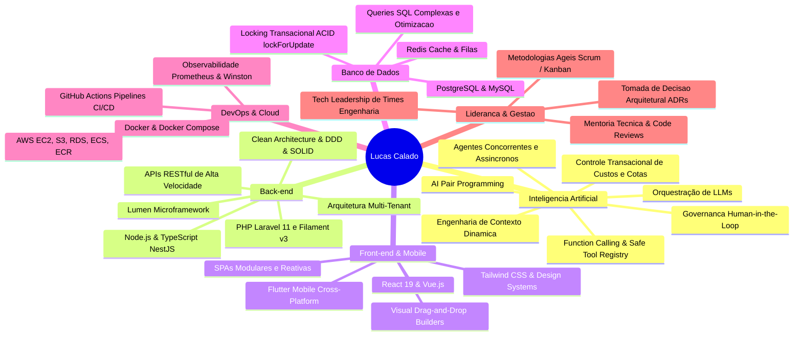

# Lucas Calado de Araújo

<div align="center">

### **Senior Full Stack Developer | Tech Lead | Enterprise AI Architect**
**Recife, Pernambuco, Brasil**

[](https://www.linkedin.com/in/lucas-calado/)
[](mailto:lcaraujo4252@gmail.com)
[_99221--4955-25D366?style=for-the-badge&logo=whatsapp&logoColor=white)](https://wa.me/5581992214955)
[](https://github.com/CaladoLucas)

---

```
> 8+ Anos de Engenharia de Software | Liderança Técnica | Soluções Web de Alta Escala
> Especialista em PHP (Laravel 11, Filament v3) | TypeScript (React 19, NestJS, Nx Monorepo)
> Pioneiro na Produção de IA Generativa Corporativa (Orquestração de LLMs, HITL, Agentes Concorrentes)
```

</div>

---

## 📌 Resumo Profissional / Executive Overview

Engenheiro de Software Sênior e Líder Técnico com **mais de 8 anos de experiência sólida** no desenvolvimento de sistemas web de alta escalabilidade, soluções corporativas em produção com alto volume de usuários e arquiteturas orientadas a microsserviços e APIs seguras.

- **Especialista em Ecossistema Backend & Corporativo:** Profundo domínio em **PHP (Laravel, Filament v3, Lumen)** e **Node.js / TypeScript (NestJS, Nx Monorepos)**, desenhando arquiteturas multi-tenant, aplicando Clean Architecture, Domain-Driven Design (DDD) e SOLID.
- **Pioneiro em Inteligência Artificial Generativa Enterprise:** Concepção e implantação em produção de ecossistemas de **agentes de IA autônomos concorrentes**, orquestração de LLMs com **engenharia de contexto dinâmica (personas)**, **Safe Tool Registry / Function Calling com governança estrita Human-in-the-Loop (HITL)** e controle transacional de custos/cotas de inferência.
- **Frontend Moderno & SPAs Reativas:** Criação de construtores visuais de páginas (drag-and-drop), renderização reativa em tempo real com **React, Vue.js, TypeScript e Tailwind CSS**, desacoplamento de rascunhos (autosave) e snapshots de publicação.
- **Bancos de Dados & Alta Performance:** Modelagem e otimização avançada de queries SQL em **MySQL e PostgreSQL**, locking pessimista (`lockForUpdate`) para consistência financeira ACID, índices compostos e caching com **Redis**.
- **DevOps, Cloud & Liderança:** Esteiras robustas de **CI/CD com GitHub Actions**, conteinerização com **Docker**, deploy automatizado na **AWS (EC2, S3, RDS, ECS)**, observabilidade distribuída e mentoria técnica de times de engenharia.

---

## 🚀 Repositórios em Destaque / Flagship Showcase Repositories

Os repositórios abaixo foram construídos como **demonstrações práticas e aprofundadas** de cada um dos pilares de senioridade e liderança técnica descritos em meu currículo:

| Repositório | Pilar de Habilidade & Domínio Técnico | Stack & Arquitetura |
| :--- | :--- | :--- |
| [🤖 **enterprise-ai-orchestrator**](https://github.com/CaladoLucas/enterprise-ai-orchestrator) | **Orquestração de LLMs & Governança Enterprise:** Engenharia de contexto dinâmica (Personas), Safe Tool Registry com validação Zod, governança estrita **Human-in-the-Loop (HITL)** para ações críticas e carteira transacional de custos/cotas de inferência de tokens. | TypeScript, Node.js 20+, Clean Architecture, Zod, Vitest, Docker, CI/CD |
| [⚡ **concurrent-ai-agents-runtime**](https://github.com/CaladoLucas/concurrent-ai-agents-runtime) | **Agentes Autônomos Concorrentes & DAG Engine:** Orquestração de múltiplos agentes de IA especializados trabalhando de forma simultânea e assíncrona (Fan-Out / Fan-In) para análises complexas, com worker pool, controle de concorrência e telemetria OpenTelemetry. | TypeScript, DAG Engine, Async Worker Pool, OpenTelemetry, Vitest, Docker |
| [🏛️ **laravel-filament-enterprise-core**](https://github.com/CaladoLucas/laravel-filament-enterprise-core) | **Arquitetura Corporativa Multi-Tenant & ERP:** Implementação completa com **Laravel 11 e Filament v3**, CRM de captação de leads, funil de conversão, auditoria de créditos com ACID Locking pessimista (`lockForUpdate`), índices compostos e otimização SQL. | PHP 8.3, Laravel 11, Filament v3, Livewire, PostgreSQL, Redis, Pest, Docker |
| [🎨 **reactive-page-builder**](https://github.com/CaladoLucas/reactive-page-builder) | **Frontend Moderno & Construtor Visual Reativo:** Page builder drag-and-drop em tempo real, renderização reativa, fluxo desacoplado de rascunho (autosave com debouncing) vs. publicação imutável, e formulário dinâmico de captação de leads integrado ao funil de CRM. | React 19, TypeScript, Tailwind CSS, Zustand, Vite, Vitest, Docker, Nginx |
| [☁️ **nestjs-cloud-monorepo**](https://github.com/CaladoLucas/nestjs-cloud-monorepo) | **Microsserviços & Cloud Platform (Nx Monorepo):** Arquitetura distribuída em NestJS, Clean Architecture, segurança com JWT e RBAC, persistência com PostgreSQL e Prisma, métricas Prometheus e pipeline automatizado de CI/CD para AWS ECS via Docker. | NestJS, TypeScript, Nx Monorepo, PostgreSQL, Prisma, Prometheus, Docker, AWS CI/CD |
| [🧠 **agentic-engineering-skills**](https://github.com/CaladoLucas/agentic-engineering-skills) | **Skills de Engenharia para Agentes de IA:** Otimização de Fan-Out com DAG e economia de 70% de tokens, automação de QA E2E com Playwright e gerador padronizado de atividades para Linear, Jira e ClickUp. | TypeScript, Claude Code Skills, Codex Skills, Playwright, Linear/Jira/ClickUp |
| [🏢 **HomeOfficeTeatec**](https://github.com/CaladoLucas/HomeOfficeTeatec) | **Plataforma de Gestão Corporativa:** Gestão de rotinas e acompanhamento operacional remoto corporativo. | PHP, Laravel, MySQL, Docker |

---

## 🛠️ Matriz de Habilidades & Stack Tecnológica



---

## 💼 Trajetória Profissional / Professional Experience

### 🔹 **Consultor Técnico & Engenheiro de Software Sênior** — *Amais Cobrança* (Recife, PE)
*Jun 2025 – Presente*
- **Assistente Conversacional com IA Generativa:** Arquitetura e desenvolvimento de ponta a ponta integrado nativamente ao ERP educacional corporativo (Laravel + Vue.js).
- **Orquestração de LLMs & Safe Tool Registry:** Engenharia de contexto orientada a personas e ecossistema seguro de Function Calling com governança estrita **Human-in-the-Loop (HITL)**.
- **Monetização e Controle de Inferência:** Carteira transacional de créditos pré-pagos e cotas por usuário com recarga automatizada via webhooks de pagamento.
- **Construtor Visual de Páginas:** Desenvolvimento em React e Tailwind CSS com renderização em tempo real, drag-and-drop e fluxo desacoplado de rascunho (autosave) e publicação.
- **CRM de Captação Educacional:** Gestão de leads por etapas de funil de conversão, catálogo de produtos, rastreamento analítico e notificações transacionais.
- **Módulos Filament v3 & Qualidade:** Painéis operacionais em Filament v3, automação de esteiras CI/CD e testes E2E com Playwright.

### 🔹 **Tech Lead & Desenvolvedor Full Stack Sênior** — *Amigo Tech* (Recife, PE)
*Jan 2024 – Presente*
- **Liderança Técnica & Plataformas Críticas:** Sustentação de plataformas de alta criticidade utilizando Laravel, MySQL, React, Vue.js e Tailwind CSS.
- **Agentes de IA Concorrentes:** Concepção e orquestração de múltiplos agentes autônomos simultâneos e assíncronos para tarefas analíticas complexas.
- **Cultura de AI Pair Programming:** Implantação de práticas de assistência de IA no fluxo diário do time, acelerando entregas com alta fidelidade de código.
- **Microsserviços em NestJS (TypeScript):** Arquitetura sob estrutura Nx Monorepo integrada a PostgreSQL.
- **DevOps na AWS & Observabilidade:** Concepção e sustentação de esteiras de CI/CD via GitHub Actions com deploy automatizado em contêineres Docker na AWS e monitoramento de falhas.
- **Mentoria Técnica:** Mentoria contínua de desenvolvedores júnior e pleno em Clean Code, SOLID e padrões arquiteturais.

### 🔹 **Líder Técnico & Gerente de Projetos de TI** — *TiTa Therapy* (Recife, PE)
*Out 2021 – Dez 2023*
- **Arquitetura Mobile & Web:** Ecossistema cliente com Flutter e backend de alta velocidade em Laravel (Lumen).
- **Liderança de Engenharia:** Gestão técnica de equipes multidisciplinares, decisões de infraestrutura cloud e publicação nas lojas Google Play e Apple App Store.
- **Gestão Ágil:** Condução de ritos técnicos (Scrum/Kanban), refinamento de backlog e alinhamento estratégico com o negócio.

### 🔹 **Desenvolvedor PHP / Laravel** — *Britvic* (Recife, PE)
*Jun 2020 – Set 2021*
- Engenharia de sistemas internos voltados ao processamento, consolidação e modelagem de grandes volumes de dados de vendas, estoque e logística.
- Otimização avançada de queries SQL em bancos relacionais e aplicação de padrões de projeto consolidados (Design Patterns).

### 🔹 **Desenvolvedor PHP (Laravel) & Gerente de Projetos** — *Instituto EPC* (Recife, PE)
*Mar 2018 – Mai 2020*
- Desenvolvimento de ponta a ponta de ERP de gestão educacional (faturamento, controle acadêmico e administrativo) em Laravel e MySQL.
- Modelagem de dados, exportação de relatórios complexos em PDF/Excel com consultas SQL otimizadas.

### 🔹 **Desenvolvedor Delphi & PHP / MySQL** — *NewBird Informática* (Recife, PE)
*Jan 2016 – Fev 2018*
- Manutenção e evolução de ERP focado em faturamento, controle de estoque e conciliação de dados.

---

## 🎓 Formação Acadêmica

- **Pós-Graduação em Desenvolvimento de Aplicativos Móveis** (2019) — *CESAR School (C.E.S.A.R), Recife/PE*
- **Graduação em Gestão de Tecnologia da Informação** (2018) — *Centro Universitário FG (UNIFG), Recife/PE*

---

## 📬 Contato & Conexões

Estou sempre aberto a novos desafios de liderança técnica, arquitetura de sistemas corporativos de alta escala e consultoria em IA aplicada. Vamos conversar!

- 📍 **Localização:** Recife, PE — Brasil (Disponível para atuação Remota ou Híbrida)
- 💼 **LinkedIn:** [linkedin.com/in/lucas-calado](https://www.linkedin.com/in/lucas-calado/)
- ✉️ **E-mail:** [lcaraujo4252@gmail.com](mailto:lcaraujo4252@gmail.com)
- 📱 **Telefone / WhatsApp:** [+55 (81) 99221-4955](https://wa.me/5581992214955)
- 🐙 **GitHub:** [@CaladoLucas](https://github.com/CaladoLucas)
