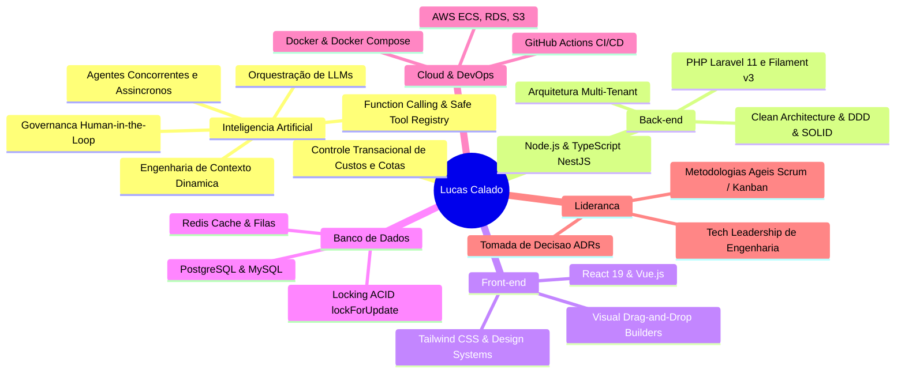

<!-- Dynamic Header Banner -->

 

[_99221--4955-25D366?style=for-the-badge&logo=whatsapp&logoColor=white)](https://wa.me/5581992214955)

 

<!-- Top Languages Card (Tokyo Night) -->

  

---

### 🛠️ Tech Stack & Ferramentas

  

  
  
  
  
  
  

---

### 🚀 Repositórios em Destaque (Showcase Prático)

Projetos completos desenvolvidos como prova técnica de senioridade e arquitetura:

| Projeto | O que Resolve na Prática | Stack Principal |
| :--- | :--- | :--- |
| 🤖 [**enterprise-ai-orchestrator**](https://github.com/CaladoLucas/enterprise-ai-orchestrator) | Orquestração de LLMs com personas dinâmicas, validação Zod, governança **Human-in-the-Loop** e carteira transacional de custos/cotas de tokens. | `TypeScript` `Node.js` `Vitest` `Docker` |
| ⚡ [**concurrent-ai-agents-runtime**](https://github.com/CaladoLucas/concurrent-ai-agents-runtime) | Motor de DAG e runtime de agentes analíticos em paralelo (Fan-Out/Fan-In), com worker pool, backpressure e telemetria OpenTelemetry. | `TypeScript` `DAG Engine` `OpenTelemetry` |
| 🏛️ [**laravel-filament-enterprise-core**](https://github.com/CaladoLucas/laravel-filament-enterprise-core) | ERP corporativo multi-tenant em Laravel 11 & Filament v3, CRM de leads, locking pessimista (`lockForUpdate`) e queries SQL otimizadas. | `Laravel 11` `Filament v3` `PostgreSQL` `Pest` |
| 🎨 [**reactive-page-builder**](https://github.com/CaladoLucas/reactive-page-builder) | Construtor visual drag-and-drop a 60fps, renderização reativa, autosave debounced desacoplado e formulário inteligente de captação de leads. | `React 19` `Tailwind CSS` `Zustand` `Vite` |
| ☁️ [**nestjs-cloud-monorepo**](https://github.com/CaladoLucas/nestjs-cloud-monorepo) | Microsserviços em Nx Monorepo, Clean Architecture, segurança JWT/RBAC, PostgreSQL (Prisma), métricas Prometheus e deploy AWS ECS via Docker. | `NestJS` `Nx Monorepo` `PostgreSQL` `AWS ECS` |
| 🧠 [**agentic-engineering-skills**](https://github.com/CaladoLucas/agentic-engineering-skills) | Suíte de skills para agentes de IA: Otimizador de Fan-Out com DAG e economia de ~70% de tokens, QA com Playwright e gerador Linear/Jira/ClickUp. | `TypeScript` `Playwright` `Linear/Jira/ClickUp` |

---

<b>💼 Trajetória Profissional (8+ Anos de Experiência)</b>

 

- 🏢 **Amais Cobrança** *(Jun 2025 – Presente)* — **Consultor Técnico & Engenheiro Sênior**  
  *Assistente conversacional de IA nativo no ERP, construtor visual em React/Tailwind, CRM de captação e módulos Filament v3.*
- 🚀 **Amigo Tech** *(Jan 2024 – Presente)* — **Tech Lead & Dev Full Stack Sênior**  
  *Liderança técnica em plataformas de alta criticidade, agentes de IA concorrentes, APIs NestJS em Nx e esteiras CI/CD AWS.*
- 🩺 **TiTa Therapy** *(Out 2021 – Dez 2023)* — **Tech Lead & Gerente de Projetos**  
  *Ecossistema mobile com Flutter, APIs de alta velocidade em Lumen/Laravel e condução ágil multidisciplinar.*
- 🏭 **Britvic** *(Jun 2020 – Set 2021)* — **Desenvolvedor PHP / Laravel**  
  *Processamento e consolidação de grandes volumes de dados de vendas/estoque e queries SQL avançadas.*
- 🎓 **Instituto EPC** *(Mar 2018 – Mai 2020)* — **Dev PHP (Laravel) & Gerente de Projetos**  
  *ERP de gestão educacional de ponta a ponta, faturamento e relatórios analíticos complexos.*
- 🖥️ **NewBird Informática** *(Jan 2016 – Fev 2018)* — **Desenvolvedor Delphi & PHP / MySQL**  
  *Evolução de ERP legado, conciliação financeira e controle de estoque.*

---

<b>🎓 Formação Acadêmica</b>

 

- 📱 **Pós-Graduação em Desenvolvimento de Aplicativos Móveis** — *CESAR School (2019)*
- 🎓 **Graduação em Gestão de Tecnologia da Informação** — *Centro Universitário FG (UNIFG) (2018)*

---

### 🤝 Vamos conversar?

Disponível para novos desafios de liderança técnica, arquitetura de sistemas e consultoria de IA aplicada.

